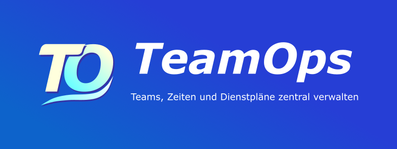
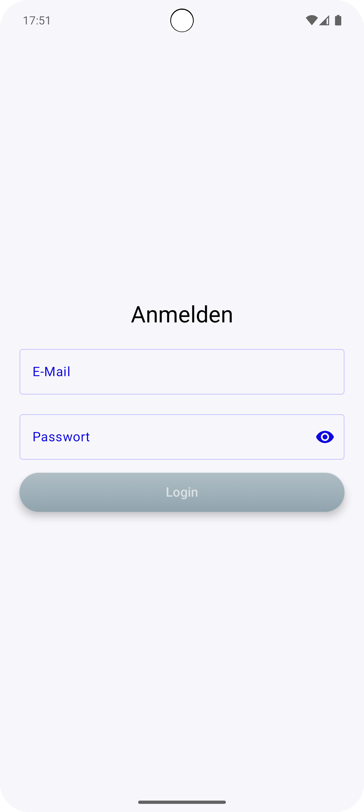
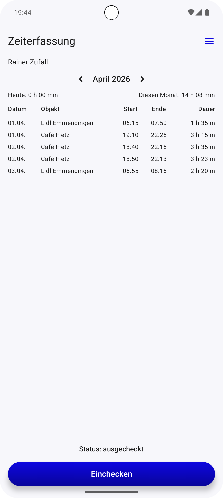
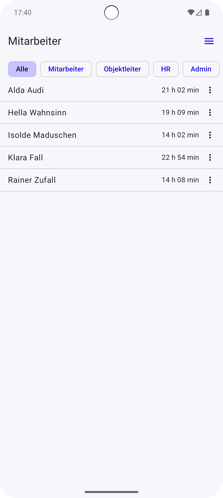
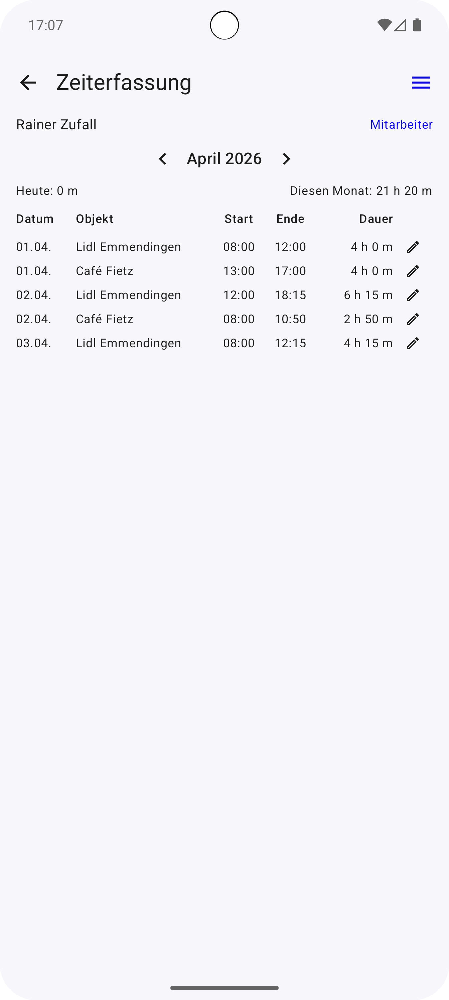
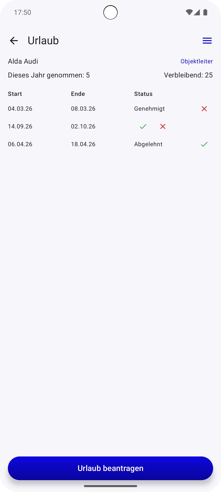
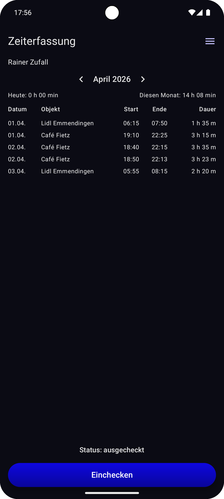

# TeamOps



*TeamOps* ist ein Android-Portfolio-Projekt für die Organisation kleiner Teams und mobiler Arbeitsabläufe. Die App bündelt Arbeitszeiterfassung, Dienstplanung, Urlaubsverwaltung und rollenbasierte Zugriffssteuerung in einer mobilen Anwendung.

---

## Überblick

Viele kleine Unternehmen organisieren Dienstpläne, Arbeitszeiten und Urlaubsanträge noch über verschiedene Tools oder manuell. Dadurch entstehen schnell Unübersichtlichkeit und zusätzlicher Verwaltungsaufwand.

TeamOps setzt genau hier an: Mitarbeitende können ihre Arbeitszeiten per Check-in und Check-out erfassen, während Manager, HR und Admins Arbeitszeiten, Dienstpläne und Urlaubsanträge verwalten können.

---

## Screenshots

<p align="center">
  
  
  
  
</p>

<p align="center">
  
  
</p>

---

## Features

- Arbeitszeiten per Check-in / Check-out erfassen
- Standortbasierte Objektzuordnung für Worker
- Rollenbasierter Zugriff für Worker, Manager, HR und Admin
- Monatsübersicht mit Tages- und Gesamtarbeitszeit
- Mitarbeiterübersicht mit rollenabhängiger Sichtbarkeit
- Dienstpläne für Mitarbeitende anzeigen und verwalten
- Urlaubsanträge einreichen, genehmigen oder ablehnen
- Lokale Speicherung mit Room
- Synchronisierung mit Firebase Firestore
- Dark Mode Unterstützung

---

## Rollenmodell

TeamOps unterscheidet verschiedene Nutzerrollen:

| Rolle   | Zugriff                                                                                   |
|---------|-------------------------------------------------------------------------------------------|
| Worker  | Eigene Arbeitszeiten erfassen, Dienstplan einsehen und Urlaub beantragen                  |
| Manager | Mitarbeitende im eigenen Team einsehen, Dienstpläne erstellen und Arbeitszeiten verwalten |
| HR      | Mitarbeitende, Arbeitszeiten, Dienstpläne und Urlaubsanträge verwalten                    |
| Admin   | Erweiterter administrativer Zugriff                                                       |

Die Sichtbarkeit und Bearbeitbarkeit von Daten wird abhängig von der jeweiligen Rolle gesteuert.

---

## Tech Stack

- Kotlin
- Jetpack Compose
- Hilt
- Room
- Firebase Authentication
- Firebase Firestore
- Kotlin Coroutines & Flow
- Compose Navigation
- Location Services

---

## Architektur

Die App folgt einer MVVM-orientierten Architektur mit klarer Trennung zwischen UI, ViewModel, Repository und Datenquellen.

Zentrale Architekturmerkmale:

- Repository Pattern zur Trennung von lokaler und remote Datenquelle
- Reaktive UI-State-Verwaltung mit Kotlin Flow
- Lokale Persistenz mit Room
- Remote-Synchronisierung mit Firebase Firestore
- Rollenbasierte Zugriffskontrolle für unterschiedliche Nutzergruppen

---

## Projektfokus

Der Fokus des Projekts liegt auf:

- sauberer Android-Architektur
- rollenbasierter Zugriffskontrolle
- reaktiver UI-State-Verwaltung
- lokaler Speicherung und Cloud-Synchronisierung
- praxisnahen Workflows für kleine Teams
- moderner Android-Entwicklung mit Kotlin und Jetpack Compose

---

## Geplante Erweiterungen

- Objekte direkt in der App bearbeiten und löschen
- Erweiterte Nutzerverwaltung mit Einladungsprozess und Passwortregeln
- Export von Arbeitszeiten für Abrechnung und Verwaltung
- Ausbau der Testabdeckung

---

## Demo

Für einen schnellen Eindruck kann die App mit einem eingeschränkten Worker-Demo-Account getestet werden.

| Rolle  | E-Mail                  | Passwort        |
|--------|-------------------------|-----------------|
| Worker | worker.demo@example.com | WorkerDemo!2026 |

Der Demo-Account ist ausschließlich für Testzwecke gedacht und hat nur eingeschränkte Rechte.

---

## Setup für lokale Entwicklung

Für eine lokale Ausführung mit eigener Firebase-Instanz kann ein eigenes Firebase-Projekt verwendet werden.

1. Repository klonen

   ```bash
   git clone https://github.com/RebeccaCalabretta/teamops-android.git
   ```

2. Projekt in Android Studio öffnen

3. Firebase Authentication und Firestore im eigenen Firebase-Projekt aktivieren

4. Firebase-Konfigurationsdatei hinzufügen

   ```text
   app/google-services.json
   ```

5. Projekt synchronisieren und App starten